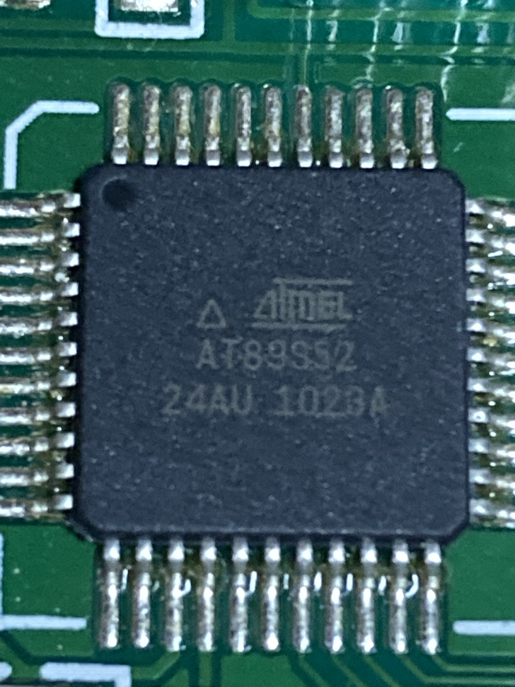

# sclm_p105 (SCLM-P105)

<a href="https://github.com/PEARLPALMS/sclm_p105/">GitHubページ</a><br>
<br>

Googleの生成AIによると。。。<br>
SCLM-P105 は、RGB バックライトを搭載した 8 色カラー、10 桁＋固定マーク表示の 7 セグメント液晶モジュールです。<br>
デジットで 20 円で販売されており、Arduino 用のライブラリーが提供されています。<br>
だそうです。<br>
<br>

# 別名は20円さん

デジットが移転するときに話題になり、ネット上では20円さんと呼ばれ、大量にネット注文する人もいました。<br>
<br>

# 公式ライブラリは無く、幾つかの有志のみ

ちなみに Arduino用のライブラリー は、オフィシャルが提供しているものはありません。<br>
個人的に実装している方がいらっしゃるようです。<br>
<br>

詳しく解説されている方がいらっしゃいます。<br>
> [mintia666/SCLM-P105] (https://github.com/mintia666/SCLM-P105)<br>
<br>

私の実装も独自であり、データシートと動作確認のみで作られております。<br>
アドバンテージもありませんが、サンプルを豊富に用意しました。<br>
```
時期を過ぎたためにページを作るのが面倒なだけで、WEB上に残すのがせめてもの。。。
```
<br>

> 店頭デモ機<br>

 
<br>

> 売り場はジャンクそのモノ<br>

 
<br>

> 基盤にはマイコンも実装されている<br>

 
<br>

